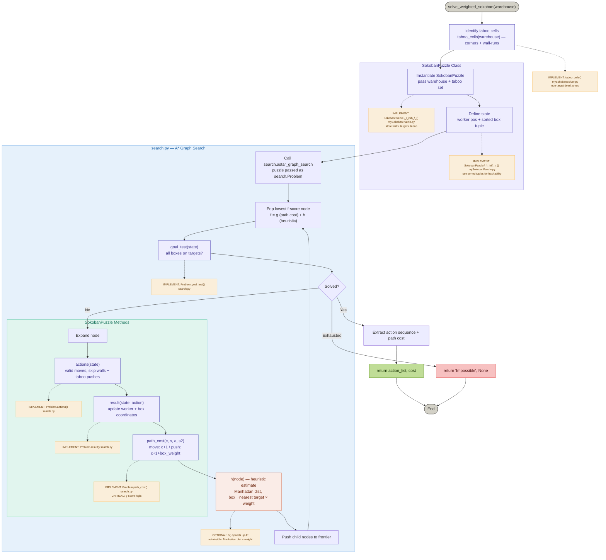

### Code flow-chart

```mermaid
flowchart TB
 subgraph SokobanPuzzle_Class["SokobanPuzzle Class"]
        InitPuzzle["Instantiate SokobanPuzzle<br>pass warehouse + taboo set"]
        note_init["IMPLEMENT: SokobanPuzzle.\_\_init\_\_() mySokobanPuzzle.py<br>store walls, targets, taboo"]
        StateDef["Define state<br>worker pos + sorted box tuple"]
        note_state["IMPLEMENT: SokobanPuzzle.\_\_init\_\_() mySokobanPuzzle.py<br>use sorted tuples for hashability"]
  end
 subgraph Puzzle_Logic["SokobanPuzzle Methods"]
        Expand["Expand node"]
        Actions["actions(state)<br>valid moves, skip walls + taboo pushes"]
        note_actions["IMPLEMENT: Problem.actions() search.py"]
        Result["result(state, action)<br>update worker + box coordinates"]
        note_result["IMPLEMENT: Problem.result() search.py"]
        Cost["path_cost(c, s, a, s2)<br>move: c+1 / push: c+1+box_weight"]
        note_cost["IMPLEMENT: Problem.path_cost() search.py<br>CRITICAL: g-score logic"]
  end
 subgraph Search_Algorithm["search.py — A* Graph Search"]
        CallSearch["Call search.astar_graph_search<br>puzzle passed as search.Problem"]
        PopNode["Pop lowest f-score node<br>f = g (path cost) + h (heuristic)"]
        GoalTestNode["goal_test(state)<br>all boxes on targets?"]
        note_goal["IMPLEMENT: Problem.goal_test() search.py"]
        GoalTest{"Solved?"}
        Puzzle_Logic
        Heuristic["h(node) — heuristic estimate<br>Manhattan dist, box→nearest target × weight"]
        note_h["OPTIONAL: h() speeds up A*<br>admissible: Manhattan dist × weight"]
        PushQueue["Push child nodes to frontier"]
  end
    InitPuzzle -.-> note_init
    InitPuzzle --> StateDef
    StateDef -.-> note_state
    GoalTestNode -.-> note_goal
    Actions -.-> note_actions
    Result -.-> note_result
    Cost -.-> note_cost
    Expand --> Actions
    Actions --> Result
    Result --> Cost
    Heuristic -.-> note_h
    CallSearch --> PopNode
    PopNode --> GoalTestNode
    GoalTestNode --> GoalTest
    GoalTest -- No --> Expand
    Cost --> Heuristic
    Heuristic --> PushQueue
    PushQueue --> PopNode
    Taboo["Identify taboo cells<br>taboo_cells(warehouse) — corners + wall-runs"] -.-> note_taboo["IMPLEMENT: taboo_cells() mySokobanSolver.py<br>non-target dead zones"]
    Start(["solve_weighted_sokoban(warehouse)"]) --> Taboo
    Taboo --> InitPuzzle
    StateDef --> CallSearch
    GoalTest -- Yes --> ExtractSuccess["Extract action sequence + path cost"]
    ExtractSuccess --> ReturnSuccess["return action_list, cost"]
    ReturnSuccess --> End(["End"])
    GoalTest -- Exhausted --> ReturnImpossible@{ label: "return 'Impossible', None" }
    ReturnImpossible --> End

    ReturnImpossible@{ shape: rect}
     InitPuzzle:::impl
     note_init:::note
     StateDef:::impl
     note_state:::note
     Actions:::impl
     note_actions:::note
     Result:::impl
     note_result:::note
     Cost:::impl
     note_cost:::note
     GoalTestNode:::impl
     note_goal:::note
     Heuristic:::optional
     note_h:::note
     Taboo:::impl
     note_taboo:::note
     Start:::terminal
     ReturnSuccess:::success
     End:::terminal
     ReturnImpossible:::fail
    classDef terminal fill:#D3D1C7,stroke:#5F5E5A,color:#2C2C2A
    classDef note fill:#FAEEDA,stroke:#FAC775,color:#633806,font-size:11px
    classDef fail fill:#F7C1C1,stroke:#E24B4A,color:#501313
    classDef success fill:#C0DD97,stroke:#639922,color:#173404
    classDef impl fill:#EEEDFE,stroke:#534AB7,color:#3C3489
    classDef optional fill:#FAECE7,stroke:#D85A30,color:#712B13
    style Puzzle_Logic fill:#E1F5EE,stroke:#5DCAA5,color:#0F6E56
    style SokobanPuzzle_Class fill:#EEEDFE,stroke:#AFA9EC,color:#3C3489
    style Search_Algorithm fill:#E6F1FB,stroke:#85B7EB,color:#185FA5
```