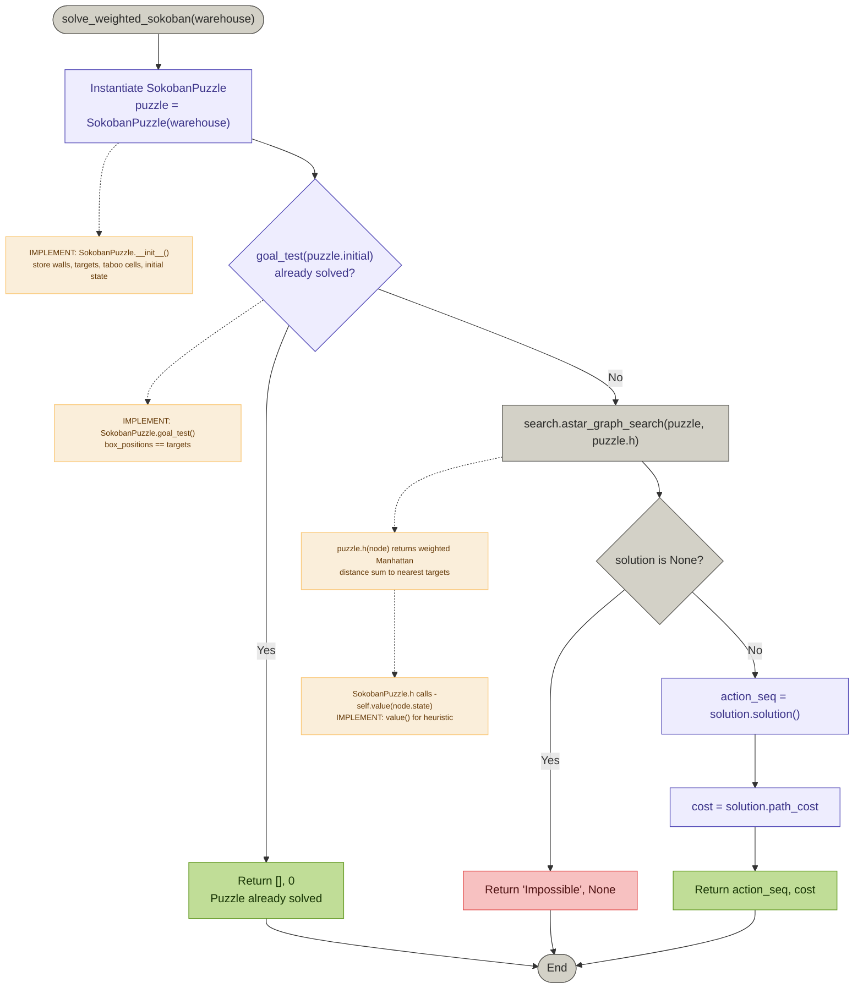
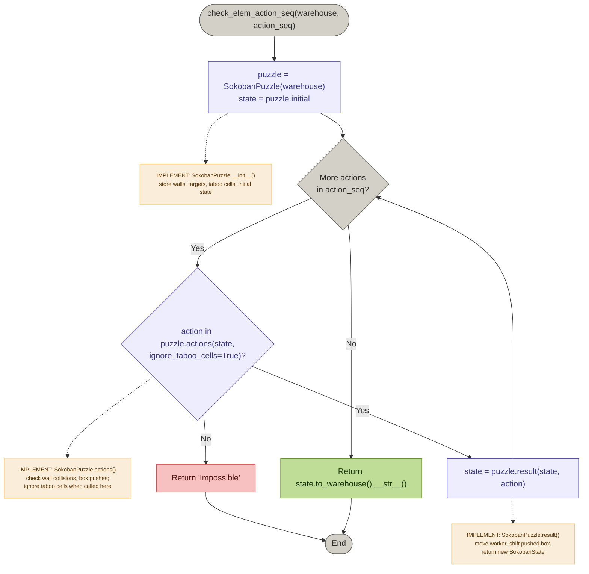

# CAB320 Assignment 1 — Sokoban Solver Checklist

> **Team members:** Stephen Dang (11530189) · Hieu Pham (11463333) · Oliver Stewart (11588608)
>
> Fill in the **Owner** field for each phase and tick boxes as you complete tasks.

---

## Phase 1 — Setup & Understanding

| Owner |     |
| ----- | --- |
| Oliver   |     |

- Read and understand `sokoban.py` — how `Warehouse` loads puzzles, what `walls`, `boxes`, `targets`, `worker`, `weights` contain
- Read and understand `search.py` — how `Problem`, `Node`, and `astar_graph_search` work together
- Download/add warehouse `.txt` puzzle files into the `warehouses/` folder
- Run `gui_sokoban.py` to visually explore a puzzle and understand the game mechanics
- Agree on state representation: `(worker_xy, tuple(sorted(box_positions)))` — confirm it is hashable and correct

### Code flowchart

---

## Phase 2 — `taboo_cells(warehouse)` *(5 pts)*

| Owner |     |
| ----- | --- |
| Stephen   |     |

- Write logic to detect which cells are **inside** the warehouse (flood-fill from outside, or scan from walls inward)
- Implement **Rule 1**: a non-target corner cell is taboo (blocked on two perpendicular sides)
- Implement **Rule 2**: cells between two taboo corners along a wall are also taboo if none is a target
- Build the return string — only `#` walls and `X` taboo cells, no worker/boxes/targets shown
- Test against the `sanity_check.py` expected output for `warehouse_01.txt`
- Write additional manual test cases (edge cases: targets in corners, L-shaped walls)

---

## Phase 3 — `check_elem_action_seq(warehouse, action_seq)` *(4 pts)*

| Owner |     |
| ----- | --- |
| Oliver   |     |

- Map action strings (`'Up'`, `'Down'`, `'Left'`, `'Right'`) to `(dx, dy)` deltas
- Simulate each action step by step on a mutable copy of the warehouse
- Implement move-to-empty-cell logic (check for wall collision)
- Implement push-box logic (check cell beyond box — if wall or another box → `'Impossible'`)
- Return `'Impossible'` on first illegal action
- Return final warehouse state as string (`Warehouse.__str__()` format) on success
- Test both cases from `sanity_check.py` (valid sequence + impossible sequence)
- Write additional edge case tests (push into wall, push into another box, worker on target)

---

## Phase 4 — `SokobanPuzzle` Class

### `__init`__

| Owner |     |
| ----- | --- |
| Hieu   |     |

- Store static data: `walls`, `targets`, `weights`, `taboo` cells as sets for fast lookup
- Define initial state as `(worker_pos, tuple(sorted(box_positions)))`
- Call `super().__init__(initial_state)`

### `actions(self, state)`

| Owner |     |
| ----- | --- |
| Hieu   |     |

- Parse state into `worker_pos` and `box_positions`
- For each of the 4 directions, check if the move is valid:
  - Worker moving to empty cell: not a wall
  - Worker pushing a box: cell beyond the box is not a wall, not another box, and not a taboo cell
- Return list of valid action strings

### `result(self, state, action)`

| Owner |     |
| ----- | --- |
| Hieu   |     |

- Apply the action: compute new worker position
- If a box is at the new worker position, move it one cell further
- Return new state `(new_worker_pos, tuple(sorted(new_box_positions)))`

### `goal_test(self, state)`

| Owner |     |
| ----- | --- |
| Hieu   |     |

- Return `True` if the set of box positions equals the set of target positions

### `path_cost(self, c, state1, action, state2)`

| Owner |     |
| ----- | --- |
| Hieu   |     |

- Detect if a box was pushed (compare box tuples of `state1` vs `state2`)
- If no push: cost = `c + 1`
- If push: find which box moved, look up its weight → cost = `c + 1 + box_weight`
- Ensure box-to-weight mapping survives across state transitions (weight follows the box)

### `h(self, node)` *(optional but strongly recommended)*

| Owner |     |
| ----- | --- |
| Hieu   |     |

- For each unplaced box, find the Manhattan distance to its nearest target
- Multiply each distance by the box's weight
- Sum all values and return as the heuristic estimate
- Verify it is **admissible** (never overestimates the true cost)

### `value(self, state)`

| Owner |     |
| ----- | --- |
| Hieu   |     |

- Can simply `raise NotImplementedError` or `return 0` — not used by A*

---

## Phase 5 — `solve_weighted_sokoban(warehouse)` *(20 pts)*

| Owner |     |
| ----- | --- |
| Oliver   |     |

- Call `taboo_cells(warehouse)` and parse the result into a set of taboo `(x, y)` positions
- Instantiate `SokobanPuzzle(warehouse, taboo_set)`
- Call `search.astar_graph_search(puzzle)` with `problem.h` as the heuristic
- If result is `None` → return `'Impossible', None`
- If result is a node → call `.solution()` to get the action list
- Retrieve total cost from the goal node's `path_cost`
- Return `(action_list, total_cost)`
- Test on `warehouse_8a.txt` — expected cost is `431` (action path may differ)
- Test on a known impossible puzzle (e.g., `warehouse_5n.txt`)

---

## Phase 6 — Testing & Validation

| Owner       |     |
| ----------- | --- |
| All members |     |

- Run `sanity_check.py` — all 3 tests pass
- Create a custom toy puzzle (small, hand-solvable) and verify solver output manually
- Test an already-solved puzzle (goal state from start) → should return `[], 0`
- Test a puzzle with a box already on a taboo cell → should return `'Impossible', None`
- Test `check_elem_action_seq` with a sequence that solves a puzzle, verify the result string
- Benchmark on medium-difficulty puzzles (`warehouse_07.txt`, `warehouse_147.txt`) — confirm finishes within 1 minute
- Confirm `warehouse_111.txt` (hard) either finishes or times out gracefully without crashing

---

## Phase 7 — Report *(10 marks, individual submission)*

| Owner                    |     |
| ------------------------ | --- |
| All members individually |     |

- **Section 1:** State representation, heuristic design, and key implementation choices
- **Section 2:** Testing methodology — unit tests, toy problems, edge cases used
- **Section 3:** Performance results (timing table) and known limitations
- Add figures/tables for clarity (warehouse diagrams, timing data)
- Proofread — no typos, proper grammar, page numbers, section headers
- Keep strictly within **4 pages**

---

## Phase 8 — Submission

| Owner                    |     |
| ------------------------ | --- |
| All members individually |     |

- Final review of `mySokobanSolver.py` — confirm `my_team()` lists all 3 members correctly
- Confirm the file only imports `search` and `sokoban` (no extra dependencies)
- Run `sanity_check.py` one final time on a clean environment
- Zip `mySokobanSolver.py` into a `.zip` archive
- **Each member** submits the zip to Gradescope via Canvas → *Assignment 1: Planning in a Warehouse*
- **Each member** submits their individual PDF report to Canvas
- Check Gradescope auto-feedback — verify correct data types are returned for all functions

---

## Responsibility Summary

| Phase | Task                          | Owner            | Status |
| ----- | ----------------------------- | ---------------- | ------ |
| 1     | Setup & Understanding         | Oliver           | Done   |
| 2     | `taboo_cells()`               | Stephen          |        |
| 3     | `check_elem_action_seq()`     | Hieu             | Done   |
| 4a    | `SokobanPuzzle.__init`__      | Hieu             | Done   |
| 4b    | `SokobanPuzzle.actions`       | Hieu             | Done   |
| 4c    | `SokobanPuzzle.result`        | Hieu             | Done   |
| 4d    | `SokobanPuzzle.goal_test`     | Hieu             | Done   |
| 4e    | `SokobanPuzzle.path_cost`     | Hieu             | Done   |
| 4f    | `SokobanPuzzle.h` (heuristic) | Hieu             | Done   |
| 5     | `solve_weighted_sokoban()`    | Oliver           | Done   |
| 6     | Testing & Validation          | All              |        |
| 7     | Report                        | All (individual) |        |
| 8     | Submission                    | All (individual) |        |

