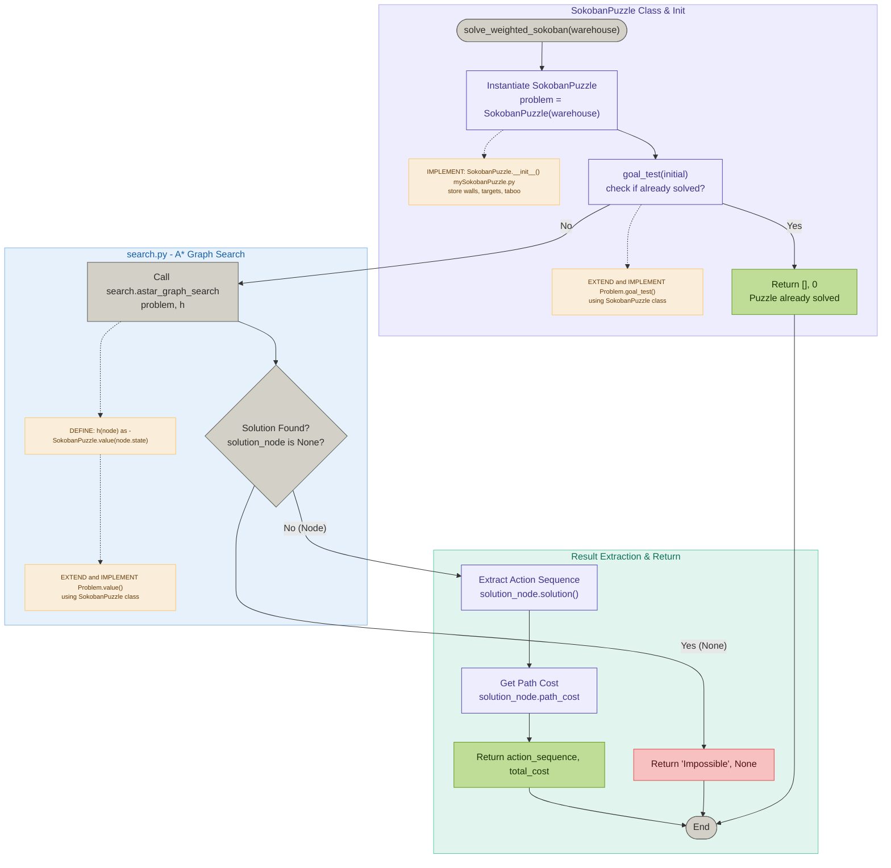

### Code flowchart

```mermaid
flowchart TB
 subgraph SokobanPuzzle_Class["SokobanPuzzle Class & Init"]
        Start(["solve_weighted_sokoban(warehouse)"])
        InitPuzzle["Instantiate SokobanPuzzle<br>problem = SokobanPuzzle(warehouse)"]
        note_init["IMPLEMENT: SokobanPuzzle.__init__() mySokobanPuzzle.py<br>store walls, targets, taboo"]
        GoalTestInitial["goal_test(initial)<br>check if already solved?"]
        note_goal_init["EXTEND and IMPLEMENT Problem.goal_test()<br>using SokobanPuzzle class"]
        ReturnEmpty["Return [], 0<br>Puzzle already solved"]
  end
 subgraph Search_Algorithm["search.py - A* Graph Search"]
        CallSearch["Call search.astar_graph_search<br>problem, h"]
        note_h["DEFINE: h(node) as -SokobanPuzzle.value(node.state)"]
        note_value["EXTEND and IMPLEMENT Problem.value()<br>using SokobanPuzzle class"]
        CheckSolution{"Solution Found?<br>solution_node is None?"}
  end
 subgraph Puzzle_Logic["Result Extraction & Return"]
        ExtractSol["Extract Action Sequence<br>solution_node.solution()"]
        GetCost["Get Path Cost<br>solution_node.path_cost"]
        ReturnSuccess["Return action_sequence, total_cost"]
        ReturnImpossible["Return 'Impossible', None"]
        End(["End"])
  end

    Start --> InitPuzzle
    InitPuzzle -.-> note_init
    InitPuzzle --> GoalTestInitial
    GoalTestInitial -.-> note_goal_init
    GoalTestInitial -- Yes --> ReturnEmpty
    ReturnEmpty --> End
    GoalTestInitial -- No --> CallSearch
    CallSearch -.-> note_h
    note_h -.-> note_value
    CallSearch --> CheckSolution
    CheckSolution -- Yes (None) --> ReturnImpossible
    ReturnImpossible --> End
    CheckSolution -- No (Node) --> ExtractSol
    ExtractSol --> GetCost
    GetCost --> ReturnSuccess
    ReturnSuccess --> End

     InitPuzzle:::impl
     note_init:::note
     GoalTestInitial:::impl
     note_goal_init:::note
     CallSearch:::terminal
     note_h:::note
     note_value:::note
     CheckSolution:::terminal
     ExtractSol:::impl
     GetCost:::impl
     Start:::terminal
     ReturnSuccess:::success
     End:::terminal
     ReturnImpossible:::fail
     ReturnEmpty:::success

    classDef terminal fill:#D3D1C7,stroke:#5F5E5A,color:#2C2C2A
    classDef note fill:#FAEEDA,stroke:#FAC775,color:#633806,font-size:11px
    classDef fail fill:#F7C1C1,stroke:#E24B4A,color:#501313
    classDef success fill:#C0DD97,stroke:#639922,color:#173404
    classDef impl fill:#EEEDFE,stroke:#534AB7,color:#3C3489
    classDef optional fill:#FAECE7,stroke:#D85A30,color:#712B13
    style Puzzle_Logic fill:#E1F5EE,stroke:#5DCAA5,color:#0F6E56
    style SokobanPuzzle_Class fill:#EEEDFE,stroke:#AFA9EC,color:#3C3489
    style Search_Algorithm fill:#E6F1FB,stroke:#85B7EB,color:#185FA5
```